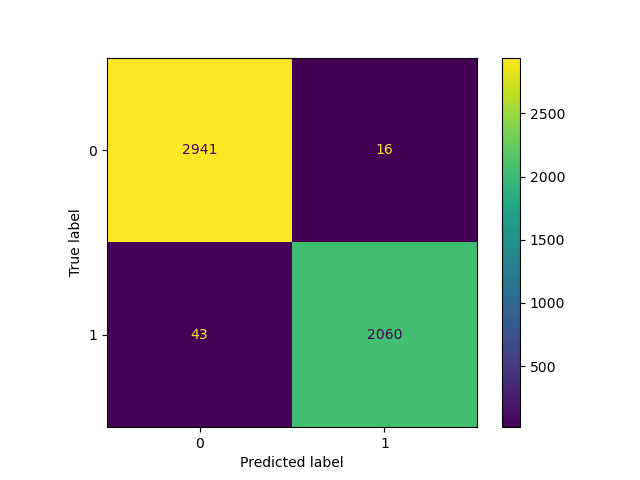
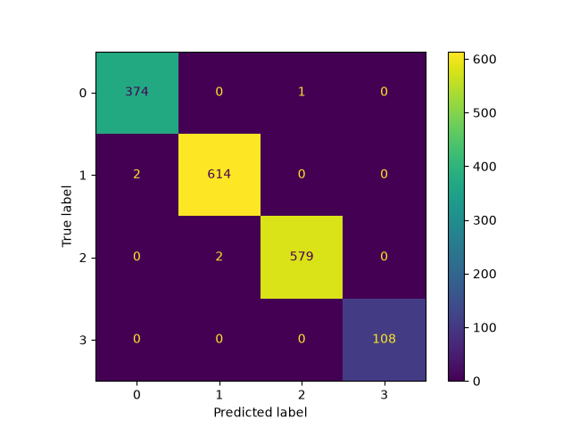
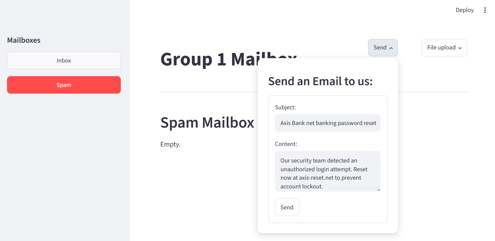
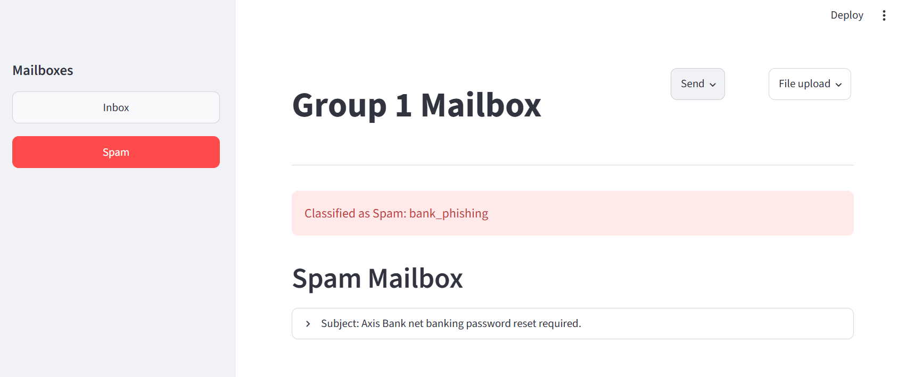
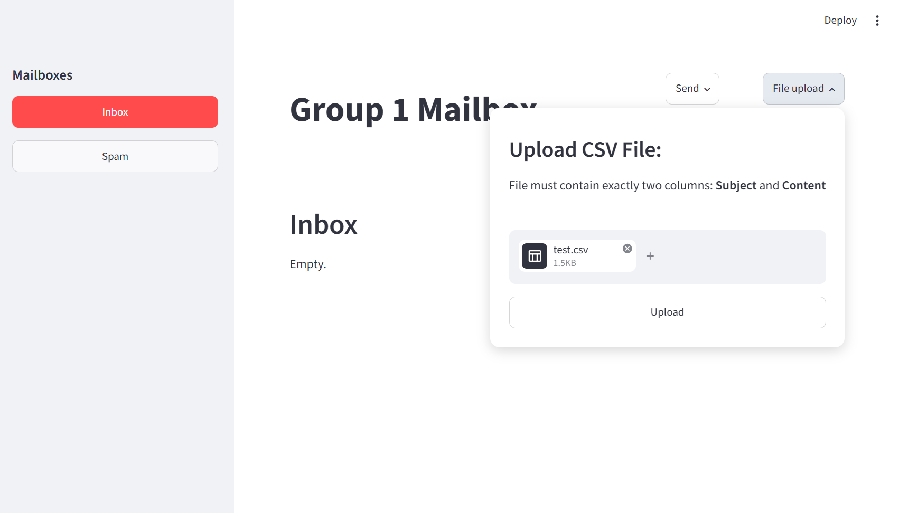
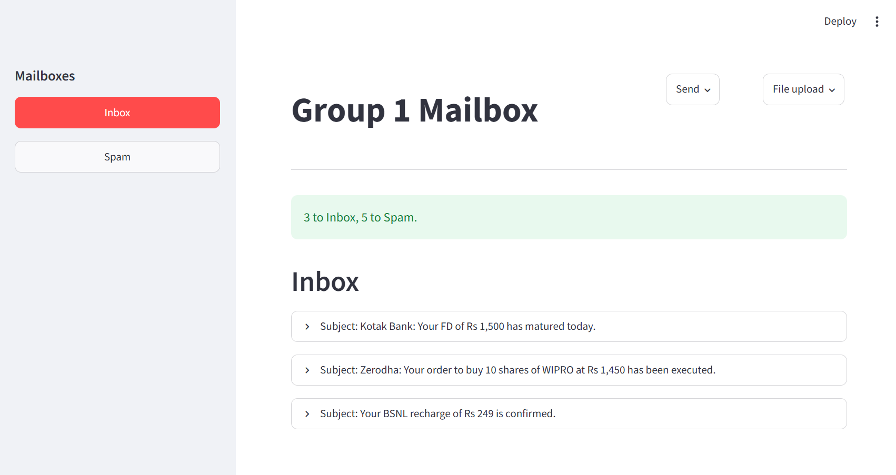

# Email Spam Classification System

CMPT 310 Group 1 | Email Classifier

## Team Members

- Ngoc Gia Bao Nguyen (301657240) - bnn@sfu.ca
- Jisoo Im (301376613) - jia24@sfu.ca
- Kevin Han (301610266) - kha166@sfu.ca

## Milestone 1: Binary Classifier (July 1)

- Datasets used:  
  `https://github.com/Apaulgithub/oibsip_taskno4/blob/main/spam.csv`  
  `https://www.kaggle.com/datasets/jackksoncsie/spam-email-dataset`
- Combined dataset with `combine.py`.
- Preprocessed raw dataset.
- Deployed Stochastic Gradient Descent using a Logistic Loss function and L2 Regularization.
- Exported the model as `stage1.pkl` for future milestone.

For part 2 we are using the following dataset:
https://www.kaggle.com/datasets/fenilsonani/email-data-for-email-classification/data

## Milestone 2: Multi-class Classifier (July 29)

- Successfully classified spam emails into various categories, namely bank_phishing, financial_fraud, government_impersonation and romance_parcel_sextortion.
- Exported the model as `stage2.pkl` for future use.
- Constructed confusion matrix for both spam prediction model and spam categorization model.
- Developed an interactive web application using Streamlit - utilizing `stage1.pkl` and `stage2.pkl` models - to interact with the system through a graphical interface instead of Python scripts.

This site allows users to:
1. Send individual emails by entering a subject and message.
2. Upload a CSV file containing multiple emails for batch classification.
3. Automatically classify each email using our trained models.
4. Route legitimate emails to the Inbox and spam emails to the Spam mailbox.
5. Display spam subcategories predicted by the second-stage classifier.

dataset: https://huggingface.co/datasets/Shade63/scam-classification-multiclass/blob/main/sentinel_dataset_multiclass.csv 

## Setup

**1. Create a virtual environment:**

- `python -m venv venv`

**2. Activate the environment:**

- **Windows (Git Bash):** `source venv/Scripts/activate`
- **Mac/Linux:** `source venv/bin/activate`

**3. Install the dependencies:**

- `pip install -r requirements.txt`

**4. Run Stage 1 & 2 classifier:**

- `python model1.py`
- `python model2.py`

**5. Run "Group 1 Mailbox" app:**

- `streamlit run email_web_app.py`

## Result

